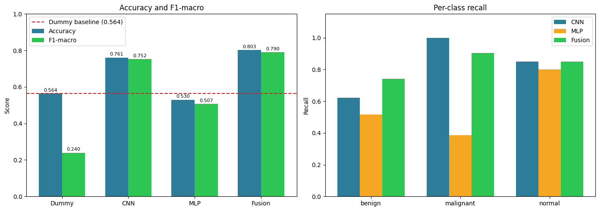
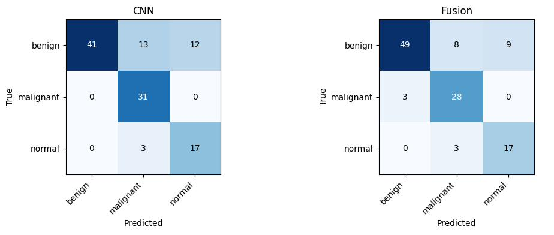
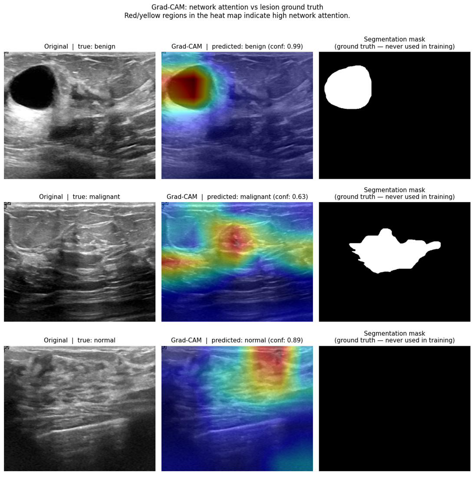
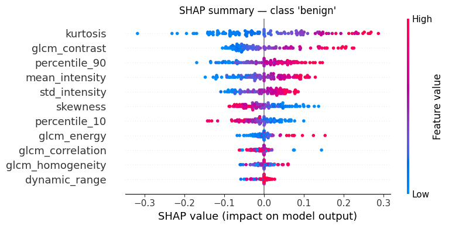
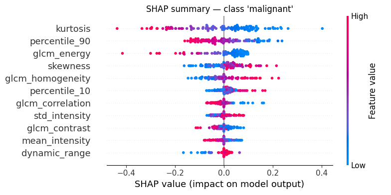
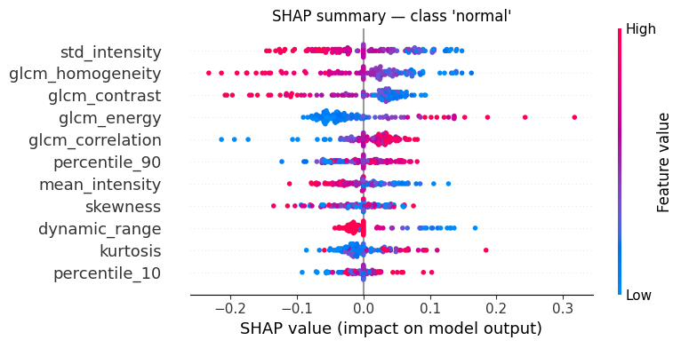

# Multimodal Deep Learning for Breast Cancer Classification

**Course**: Data Science Lab in Biosciences

This project builds a multimodal deep learning model to classify breast ultrasound images as **benign**, **malignant**, or **normal**. The model combines a CNN (which processes the raw image) with an MLP (which processes statistical features extracted from the same image), fusing the two representations to improve classification performance.

---

## What we did

**1. Dataset audit**
The provided dataset links ultrasound images to clinical and molecular CSV files. Before building any model, we verified statistically that this linkage is artificial: patients labelled *normal* carry invasive carcinoma diagnoses with average tumour sizes of 27 mm. We therefore do not use the CSV files as model input.

**2. CNN on raw images**
We fine-tuned EfficientNet-B0 (pre-trained on ImageNet) on the ultrasound images. The first 7 of 9 convolutional blocks are frozen to prevent overfitting on a small dataset.

**3. Feature extraction**
We extract 11 quantitative features from each raw image: 7 intensity statistics (mean, std, skewness, kurtosis, percentiles, dynamic range) and 4 GLCM texture descriptors (contrast, correlation, energy, homogeneity). No segmentation mask is used.

**4. MLP on radiological features**
A small MLP (11→64→32→3) is trained on these features.

**5. Multimodal fusion**
The CNN encoder (1280-dim) and MLP encoder (32-dim) are frozen. Their outputs are concatenated (1312-dim) and passed to a trainable fusion head. Only the head is trained (~2.1% of total parameters).

**6. Explainability**
Grad-CAM shows which image regions the CNN focuses on. SHAP quantifies the contribution of each feature to MLP predictions.

---

## Results

| Model | Accuracy | F1-macro |
|-------|----------|----------|
| Dummy baseline | 0.564 | 0.240 |
| CNN | 0.761 | 0.752 |
| MLP | 0.530 | 0.507 |
| **Fusion** | **0.803** | **0.790** |




---

## Explainability outputs







---

## Dataset

Download from Kaggle — not included in this repository.

[Multi-Modal Breast Cancer Dataset](https://www.kaggle.com/datasets/ajithdari/multi-modal-breast-cancer-dataset)

Place the images in `dataset/dataset1/` and the CSV files in `dataset/dataset2/` and `dataset/dataset3/`.

---

## How to run

1. Upload the project to Google Drive
2. Open `notebook/breast_cancer_multimodal.ipynb` in Google Colab
3. Select a GPU runtime
4. Update the path constants in the Setup cell
5. Run all cells

---

## Requirements

All dependencies are pre-installed on Colab. `shap` is installed automatically by the notebook.

```
torch · torchvision · numpy · pandas · scipy
scikit-learn · scikit-image · matplotlib · Pillow · shap
```
